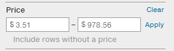
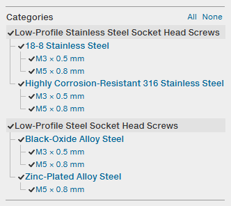
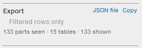

# Catalog Tools for McMaster-Carr

A userscript that adds a price filter, a category filter and JSON export to McMaster-Carr category pages.

## Features

### [Price filter](docs/GUIDE.md#Price)

Set a minimum and/or maximum price. Rows outside the range are hidden, out-of-range prices inside a visible row are dimmed, and tables and sub-categories with nothing left collapse.

  

### [Category filter](docs/GUIDE.md#Categories)

The page's categories, sub-categories and in-table groups as a tree. Click any node to hide it and everything beneath it. Turn on [Load all tables](docs/GUIDE.md#settings) and every node shows a `shown/total` count.

  

### [JSON export](docs/GUIDE.md#Export)

Download or copy every part on the page as JSON, or only the rows that pass the filters.

  

## Install

1. Install a userscript manager: [Tampermonkey](https://www.tampermonkey.net/), [Violentmonkey](https://violentmonkey.github.io/) or [Greasemonkey](https://www.greasespot.net/).
2. Open the install link and click **Install** when your manager shows the script:

   <https://raw.githubusercontent.com/NathanRWoodward/Catalog-Tools-for-McMaster-Carr/main/mcmaster-catalog-tools.user.js>

3. Open any McMaster-Carr category page. The blocks appear in the "Filter by" sidebar.

Updates arrive on your manager's normal schedule. If the link opens as plain text or the blocks do not appear, see [troubleshooting](docs/GUIDE.md#troubleshooting).

## Good to know

- The script only reads the page you have open and sends no requests of its own. It stores your price range, the "Include rows without a price" toggle and the "Load all tables" setting, and nothing else.
- The export is for your own use in deciding what to buy. Its contents are McMaster-Carr's catalog data and stay subject to their terms, which do not allow passing it on or publishing it.
- Unofficial plugin, not affiliated with or endorsed by McMaster-Carr.
- McMaster-Carr changes its page markup from time to time. If tables stop being counted, open an issue with the page URL.

## Documentation

- [User guide](docs/GUIDE.md): each block in detail, the Load all tables setting, the export format, troubleshooting.
- [Development](docs/DEVELOPMENT.md): tests, fixtures, how the parser finds things on the page.

## License

[MIT](LICENSE)
