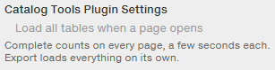

# User guide

The script adds its blocks to the "Filter by" sidebar of a McMaster-Carr category page, styled like the native filters. **Price** sits at the top, right under the sidebar header. **Categories**, **Export** and **Settings** sit at the bottom. Single-part pages get nothing.

## Price

<p align="center">
  
</p>

- The two boxes show the lowest and highest price on the page until you type.
- Enter a minimum and/or maximum and press **Apply** or Enter. **Clear** removes the range.
- A row stays visible when any of its price columns is in range. Inside a visible row, each out-of-range price is dimmed, and so is a part number whose prices are all out of range.
- Tables and sub-categories with no visible rows left are hidden.
- **Include rows without a price** keeps rows whose price cell is empty or a dash. Turn it off to hide them while a range is set.
- The range and the toggle are remembered across pages.

## Categories

<p align="center">
  
</p>

One row per category, sub-category and in-table group, joined by connector lines. Categories are dark on a grey band, sub-categories are bold blue, and groups are smaller blue text. Hovering a row darkens the lines from that row up to the top level.

- A checkmark means shown. Click a row to hide it and everything below it.
- A row that is still on but hidden by something above it shows a dash instead of a checkmark. Re-enabling the ancestor restores exactly what was on before.
- **None** hides every top-level category. **All** turns every row back on, at every level.
- Each row shows a `shown/total` count once the page's rows have been loaded: with [Load all tables](#settings) on, or after an export. Until then the counts stay hidden rather than showing incomplete numbers.
- The selection resets when you navigate to another page.

## Export

<p align="center">
  
</p>

- **JSON file** downloads `mcmaster-<page>-<date>-<time>.json`.
- **Copy** puts the same text on the clipboard.
- **Filtered rows only** exports just the rows that pass the current filters.
- If the page has not been fully loaded yet, either action loads every row first, behind the veil described under [Settings](#settings), so the export covers the whole page. Scrolling or pressing a key while that runs stops it. The export then holds what had loaded, and the message says so.
- Copy may ask for a second click after loading, because the browser only allows clipboard writes right after a click.
- The status line reads `N parts seen · T tables · K shown`, plus `P not loaded` while sub-categories are still waiting for their table to render. "seen" disappears once every row has been loaded.

The export is for your own use in deciding what to buy. The data is McMaster-Carr's catalog content and stays subject to their terms, which do not allow passing it on or publishing it.

### Export format

```json
{
  "source": {
    "url": "https://www.mcmaster.com/products/linear-ball-bearings/",
    "title": "…",
    "siteBreadcrumb": ["Power Transmission", "Bearings", "Linear Bearings"],
    "collectedAt": "2026-09-20T05:00:00.000Z",
    "filtered": false,
    "filters": null,
    "pendingSubcategories": 3,
    "version": "0.2.0"
  },
  "count": 207,
  "items": [
    {
      "partNumber": "90001A101",
      "url": "https://www.mcmaster.com/90001A101/",
      "breadcrumb": ["Linear Ball Bearings", "Self-Aligning", "Bearings"],
      "category": "Linear Ball Bearings",
      "subcategory": "Self-Aligning",
      "group": "Bearings",
      "rowGroup": ["Acetal with Stainless Steel Balls"],
      "price": 672.84,
      "prices": [{ "label": "Each", "amount": 672.84, "raw": "$672.84" }],
      "specs": {
        "For Shaft Dia.": "1/2\"",
        "Load Capacity, lb. > Dynamic": "60",
        "Load Capacity, lb. > Static": "35"
      }
    }
  ]
}
```

- One item per part number cell. A table row with several part columns, such as Bearings plus Retaining Rings or Small Pack plus Large Pack, yields one item per part.
- `group` is the column group the part number sits in. `prices` are the price columns of that group, or all price columns when the table has no groups. `price` is the lowest non-null amount. A dash cell gives `amount: null`.
- `specs` keys are the header path joined with ` > `. The part's own group prefix is dropped and other groups' prefixes are kept, so `"Pkg. Qty."` and `"Large Pack > Pkg. Qty."` can both appear. Dash cells are `null`.
- `rowGroup` lists the in-table group titles above the row, such as material and then thread size.
- `source.filters` is `null` unless **Filtered rows only** was on. Then it records the price range, the no-price toggle and the keys of the disabled categories.
- `source.pendingSubcategories` counts sub-categories whose table had not rendered when the export was built.

## Settings

<p align="center">
  
</p>

McMaster-Carr renders tables as you scroll. Right after a page loads, the script briefly tells the page the window is as tall as the content, which makes it lay out every table, so the category tree is complete within a second or two. Rows still render only as you scroll, so per-category counts cannot be complete until every row has been loaded once.

**Load all tables when a page opens** does that loading up front. The script scrolls through the tables once behind a translucent veil and returns to where you were, so counts are complete from the start and exports need no loading step. It costs a few seconds per page, which is why it is off by default. Scrolling or pressing a key outside the panel stops it.

The setting is stored with the price range.

## Troubleshooting

**The install link opens as plain text.** Your manager is not active for that page. Copy the text, create a new script in the manager's dashboard and paste it in.

**Nothing appears after installing on Chrome or Edge.** Tampermonkey needs **Developer mode** enabled on the browser's extensions page before any userscript runs.

**The blocks are missing on a page.** They only appear on pages with the "Filter by" sidebar, so single-part pages and search pages without it get nothing. If the sidebar renders after the script, the blocks appear as soon as the page next updates.

**The sidebar layout or the tree lines look wrong.** The styling uses CSS nesting and `:has()`, so it needs Chrome or Edge 112, Firefox 121 or Safari 16.5 or newer.

**Tables stop being counted.** McMaster-Carr changes its page markup from time to time. Open an issue with the page URL.

**Manager compatibility.** Tested with Tampermonkey. Violentmonkey and Greasemonkey should work too. Where a manager lacks the `GM_*` storage and style APIs, the script falls back to the page's local storage and a plain style tag.

**Updates.** The script declares an update URL, so your manager picks up new versions on its normal schedule. To update right away, use the manager's "check for updates" action.
